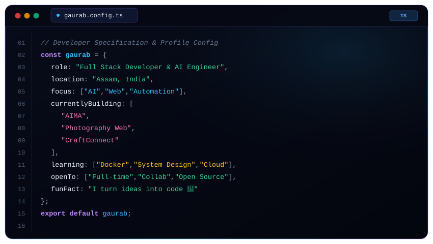

<!--
  ====================================================================
  ⚡ GAURAB DOWERAH - FUTURISTIC DEVELOPER DASHBOARD PROFILE
  ====================================================================
  
  PROFILE VARIABLES:
  - USERNAME       : Notyourapple
  - NAME           : Gaurab Dowerah
  - TITLE          : Full Stack Developer • AI Engineer • Builder
  - LOCATION       : Assam, India
  - EMAIL          : contact@gaurabdowerah.dev
  - GITHUB         : https://github.com/Notyourapple
-->

<a id="top"></a>

<div align="center">

  <!-- ================= SECTION 1: HERO DASHBOARD BANNER ================= -->
  

  <br/><br/>

  <!-- ================= PROFILE SIDEBAR & QUICK CONNECT ================= -->
  <table>
    <tr>
      <td width="30%" align="center" valign="top">
        <br/>
        
        <br/>
        <h3><b>Gaurab Dowerah</b></h3>
        <p><code>@Notyourapple</code></p>
        <p>
          
        </p>
        <p align="left" style="font-size: 13px;">
          📍 <b>Location:</b> Assam, India<br/>
          💻 <b>Role:</b> Full Stack &amp; AI Engineer<br/>
          📧 <b>Email:</b> <a href="mailto:contact@gaurabdowerah.dev">contact@gaurabdowerah.dev</a><br/>
          🔗 <b>GitHub:</b> <a href="https://github.com/Notyourapple">Notyourapple</a>
        </p>
      </td>
      <td width="70%" valign="middle">
        <p>
          <b>👋 Hello, World!</b><br/>
          I'm <b>Gaurab Dowerah</b>, a Full Stack Developer &amp; AI Engineer passionate about building intelligent applications, AI-powered systems, and scalable digital experiences.
        </p>
        <p>
          <i>"Building intelligent systems with code, AI &amp; creativity."</i>
        </p>
        <br/>
        <b>🌐 Connect with me:</b>
        <p>
          <a href="https://linkedin.com/in/gaurabdowerah" target="_blank">
            
          </a>
          <a href="https://github.com/Notyourapple" target="_blank">
            
          </a>
          <a href="mailto:contact@gaurabdowerah.dev">
            
          </a>
          <a href="https://twitter.com/gaurabdowerah" target="_blank">
            
          </a>
          <a href="https://discord.com" target="_blank">
            
          </a>
        </p>
      </td>
    </tr>
  </table>

  <br/>

  <!-- ================= SECTION 2: STAT METRICS ================= -->
  <p align="center">
    
    <a href="https://github.com/Notyourapple?tab=followers"></a>
    <a href="https://github.com/Notyourapple?tab=repositories"></a>
    <a href="https://github.com/Notyourapple?tab=repositories"></a>
    
  </p>

</div>


<!-- ================= SECTION 3: DEVELOPER CONFIG ================= -->
## ⚡ Developer Config (`gaurab.config.ts`)

<div align="center">
  
</div>

<br/>

```typescript
const gaurab = {
  role: "Full Stack Developer & AI Engineer",
  location: "Assam, India",
  focus: ["AI", "Web", "Automation"],
  currentlyBuilding: ["AIMA", "Photography Web", "CraftConnect"],
  learning: ["Docker", "System Design", "Cloud"],
  funFact: "I turn ideas into code 🚀"
};
```


<!-- ================= SECTION 4: CURRENT PROJECTS TRACKER ================= -->
## 🚀 Current Projects Tracker

<table>
  <thead>
    <tr>
      <th>Project</th>
      <th>Description</th>
      <th>Status</th>
      <th>Tech Stack</th>
    </tr>
  </thead>
  <tbody>
    <tr>
      <td><b>🧠 AIMA</b></td>
      <td>AI and Machine Learning project/application exploring intelligent systems</td>
      <td><code>🟢 Active Development</code></td>
      <td><code>Python</code> <code>AI/ML</code> <code>FastAPI</code></td>
    </tr>
    <tr>
      <td><b>🛍️ CraftConnect</b></td>
      <td>AI-powered marketplace connecting local artisans with buyers</td>
      <td><code>🟡 Active / Beta</code></td>
      <td><code>Next.js</code> <code>TypeScript</code> <code>Supabase</code> <code>AI</code></td>
    </tr>
    <tr>
      <td><b>📸 Photography Web</b></td>
      <td>Modern photography-focused web platform showcasing responsive visual UX</td>
      <td><code>🟢 Completed / Active</code></td>
      <td><code>JavaScript</code> <code>HTML5</code> <code>CSS3</code> <code>Web Dev</code></td>
    </tr>
    <tr>
      <td><b>⚡ AutoFlow Engine</b></td>
      <td>AI agent orchestration and automation workflows pipeline</td>
      <td><code>🔵 Planning</code></td>
      <td><code>Node.js</code> <code>LangChain</code> <code>Docker</code></td>
    </tr>
  </tbody>
</table>


<!-- ================= SECTION 5: FEATURED PROJECTS ================= -->
## ⭐ Featured Projects

<table>
  <tr>
    <td width="50%" valign="top">
      <h3 align="center">🧠 AIMA</h3>
      <p align="center">
        <b>AI &amp; Machine Learning Intelligence System</b>
      </p>
      <p>An AI and Machine Learning project focused on exploring intelligent systems, machine learning concepts, and practical AI implementations.</p>
      <p><b>Tech Stack:</b> <code>Python</code> <code>AI / ML</code> <code>Data Science</code> <code>Algorithms</code></p>
      <p align="center">
        <a href="https://github.com/Notyourapple/AIMA" target="_blank">
          
        </a>
      </p>
    </td>
    <td width="50%" valign="top">
      <h3 align="center">📸 Photography Web</h3>
      <p align="center">
        <b>Interactive Photography Web Experience</b>
      </p>
      <p>A visually focused photography web experience showcasing modern web design, responsive layouts, and interactive frontend development.</p>
      <p><b>Tech Stack:</b> <code>JavaScript</code> <code>HTML5</code> <code>CSS3</code> <code>UI/UX Design</code></p>
      <p align="center">
        <a href="https://github.com/Notyourapple/Photography-web" target="_blank">
          
        </a>
      </p>
    </td>
  </tr>
</table>


<!-- ================= SECTION 6: TECH STACK ================= -->
## 💻 Tech Arsenal & Tooling

### 🗣️ Languages
<p>
  
</p>

### 🎨 Frontend Development
<p>
  
</p>

### ⚙️ Backend & API Development
<p>
  
</p>

### 🗄️ Database & Cloud Services
<p>
  
</p>

### 🧠 AI & Machine Learning
<p>
  
</p>

### 🛠️ Developer Tools
<p>
  
</p>


<!-- ================= SECTION 7: GITHUB STATS ================= -->
## 📊 GitHub Analytics & Insights

<div align="center">
  <table>
    <tr>
      <td>
        
      </td>
      <td>
        
      </td>
    </tr>
    <tr>
      <td colspan="2" align="center">
        
      </td>
    </tr>
  </table>
</div>


<!-- ================= SECTION 8: CONTRIBUTION SNAKE ================= -->
## 🐍 Contribution Activity

<div align="center">
  <picture>
    <source media="(prefers-color-scheme: dark)" srcset="https://raw.githubusercontent.com/Notyourapple/Notyourapple/output/github-contribution-grid-snake-dark.svg" />
    <source media="(prefers-color-scheme: light)" srcset="https://raw.githubusercontent.com/Notyourapple/Notyourapple/output/github-contribution-grid-snake.svg" />
    
  </picture>
</div>


<!-- ================= SECTION 9: AI & MACHINE LEARNING ================= -->
## 🧠 Intelligent AI & Machine Learning Suite

<table>
  <tr>
    <td width="33%" valign="top">
      <h4>🧠 AIMA</h4>
      <p>AI and Machine Learning experimentation, practical algorithms, and intelligent systems.</p>
      <p><code>Python</code> <code>Machine Learning</code> <code>FastAPI</code></p>
    </td>
    <td width="33%" valign="top">
      <h4>🤖 AI Automation</h4>
      <p>Building intelligent automation workflows, LLM agents, and pipeline automation tools.</p>
      <p><code>LangChain</code> <code>Node.js</code> <code>OpenAI</code></p>
    </td>
    <td width="33%" valign="top">
      <h4>👁️ Computer Vision</h4>
      <p>Exploring computer vision, image processing, and visual AI perception systems.</p>
      <p><code>Python</code> <code>OpenCV</code> <code>PyTorch</code></p>
    </td>
  </tr>
</table>


<!-- ================= SECTION 10: DEVELOPER JOURNEY ================= -->
## 🗺️ Developer Journey Roadmap

<div align="center">

```
 2024  ──►  🌱 Started Programming & Computer Science Fundamentals
                │
                ▼
 2025  ──►  🚀 Built Full-Stack Applications & Modern Web Projects
                │
                ▼
 2026  ──►  🧠 Exploring AI, Machine Learning & Intelligent Automation
                │
                ▼
 Future ──► ⚡ Building impactful products and scalable technology
```

</div>


<!-- ================= SECTION 11: THOUGHT OF THE DAY ================= -->
## 💬 Thought of the Day

<!-- QUOTE:START -->
> 💬 "Nothing important is learned; it is simply remembered." — **Carlos Ruiz Zafon**
<!-- QUOTE:END -->


<!-- ================= SECTION 12: FOOTER ================= -->
<div align="center">

  <br/>

  

  <br/><br/>

  <p>
    <a href="#top">
      
    </a>
  </p>

</div>
